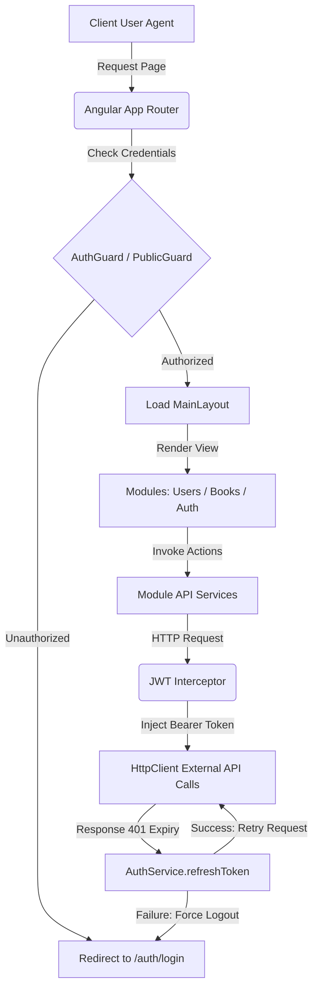

# 📚 Books FE — Enterprise Book Management Console

<p align="center">
  
  
  
  
  
</p>

---

> _A high-performance, modular, and reactive web interface designed to streamline administration, tracking, and management of books and user access controls in modern enterprise ecosystems._

---

## 📖 Core Abstract & Functional Overview

### Technical Executive Summary

This application functions as the core administration dashboard of a modern book tracking system. Built on **Angular 18+**, it provides an elegant single-page application (SPA) architecture featuring robust route protection, reactive state transitions, and a decoupled component structure.

The system addresses critical administrative pain points: it ensures secure JWT session lifecycle management with seamless background refresh cycles, handles unified error state propagation via HTTP interceptors, and provides a polished responsive interface designed using Tailwind CSS v4.

### Key Features Matrix

| Icon | Key Feature Component        | Core Business or Performance Impact                                                                         |
| :--: | :--------------------------- | :---------------------------------------------------------------------------------------------------------- |
|  🔑  | **Reactive Authentication**  | State-guaranteed user sign-up and sign-in pipelines secured with role-based route access controls.          |
|  📚  | **Unified Books CRUD**       | Complete directory management including creation, modification, categorization, and deletion of records.    |
|  👥  | **User Directory Panel**     | User entity cataloguing and privilege assignment layout structures.                                         |
|  🛡️  | **Silent Token Refresh**     | Zero-downtime session persistence via an automated background token rotation protocol.                      |
|  🔄  | **Reactive Filter Pipeline** | Streamlined data fetching binding Signals and RxJS to auto-reset pages and refresh data on mutation events. |
|  📱  | **Responsive Adaptive Grid** | Multi-device layout featuring a collapsible layout drawer for optimized viewports.                          |

---

## 🚀 Architectural Runtime Flow

Below is the execution flow when a client interacts with the workspace ecosystem:



### Runtime Details

1. **Route Interception:** Every page request passes through `authGuard` or `publicGuard` to verify user sessions.
2. **Access Token Injection:** The `authInterceptor` intercepts outgoing HTTP calls and injects the `Bearer <token>` payload.
3. **Session Recovery (401 Handler):** When an expired token error is captured from the Express API, the interceptor freezes pending calls, fetches a new token in the background, updates `localStorage`, and retries the original request seamlessly.

### Advanced Reactive State Management & Data Flow (RxJS + Signals)

The system manages directory listings (books, users) using a highly robust hybrid architecture that binds Angular Signals with RxJS streams. This architecture is illustrated below:

```mermaid
sequenceDiagram
    participant U as UI Action (Filter / Page / Search)
    participant S as Signals (page, selectedUser, debouncedSearch)
    participant C as Computed (queryFilters)
    participant RS as RxJS Stream (combineLatest)
    participant H as HTTP Cache (cacheHttp)
    participant B as Backend API

    U->>S: Mutate Signal
    Note over S: If search/filter changes, auto-reset page to 1
    S->>C: Recalculate queryFilters
    C->>RS: Emit updated filter object
    RS->>H: queryFilters OR refresh$.next() triggers switchMap
    alt Cache Hit (Valid TTL)
        H-->>RS: Return cached response immediately
    alt Cache Miss / Cache Invalidated (after POST/PATCH/DELETE)
        H->>B: GET /api/v1/books?page=X
        B-->>H: Return 200 OK + Payload
        H-->>RS: Return response + Save to GLOBAL_CACHE
    end
    RS-->>U: Update Table UI (books.set / users.set)
```

---

## 📁 Commented Annotated Directory Tree

The project structure adheres to Angular best practices, keeping concerns strictly isolated into Core, Feature Modules, and Shared scopes.

```
books-fe/
├── .angular/                 # Angular local builder caching engine
├── .vscode/                  # Shared IDE configuration templates
├── public/                   # Static assets directly exposed to build output
└── src/                      # Source code root
    ├── app/                  # Main application container
    │   ├── core/             # Global Singletons & Infrastructure Level Code
    │   │   ├── guards/       # Route protection services (auth.guard.ts, public.guard.ts)
    │   │   ├── interceptors/ # Request/Response transforms (jwt.interceptor.ts)
    │   │   ├── interfaces/   # Shared system models (pagination.ts)
    │   │   ├── services/     # Global state and utility services (toast.service.ts)
    │   │   └── utils/        # Generic helper scripts (storage.ts, pagination.ts)
    │   ├── modules/          # High-cohesion business domain modules
    │   │   ├── auth/         # Login, register components, routing & services
    │   │   ├── books/        # Books listing, creation, and detail views
    │   │   └── users/        # User directory table management components
    │   ├── shared/           # Reusable UI components & layouts (Low business logic)
    │   │   ├── components/   # Structural building blocks (aside, header, footer, ui components)
    │   │   ├── layouts/      # Visual frameworks (main-layout.component, auth-layout.component)
    │   │   ├── directives/   # Shared Angular UI behavior extensions
    │   │   └── pipes/        # Angular data mutation & formatting pipes
    │   ├── app.component.ts  # Shell entry component
    │   ├── app.config.ts     # App configuration bootstrappers & provider bindings
    │   └── app.routes.ts     # Application wide page routes declarations
    ├── environments/         # Build configuration overrides (environment.ts, environment.development.ts)
    ├── index.html            # Main SPA DOM viewport
    ├── main.ts               # Application entry point & platform booster
    └── styles.scss           # Main stylesheet importing Tailwind configuration
```

---

## 🛠️ Technical Stack & Dependency Layer

### Production Dependencies

|                                                 Icon                                                  | Core Technology / Library | Strict Semantic Version | Explicit Project Purpose                                                 |
| :---------------------------------------------------------------------------------------------------: | :------------------------ | :---------------------: | :----------------------------------------------------------------------- |
|       | `@angular/core` Suite     |        `^18.2.0`        | Framework runtime core, Router, Forms module, and animations engines.    |
|  | `@tailwindcss/postcss`    |        `^4.3.2`         | Native Tailwind CSS compilation inside the PostCSS processor pipeline.   |
|        | `rxjs`                    |        `~7.8.0`         | Asynchronous operations handler and reactive observable stream patterns. |
|    | `zone.js`                 |       `~0.14.10`        | Implements execution context hooks for Angular's CD triggers.            |

### Development/Build Tooling Dependencies

|                                                  Icon                                                  | Tooling Dependency  | Strict Semantic Version | Explicit Project Purpose                                         |
| :----------------------------------------------------------------------------------------------------: | :------------------ | :---------------------: | :--------------------------------------------------------------- |
|    | `@angular/cli`      |       `^18.2.21`        | Command line application development orchestration tools.        |
|        | `postcss`           |        `^8.5.19`        | Compiles CSS custom variables and modern layout transformations. |
|  | `typescript`        |        `~5.5.2`         | Static typing compiler target.                                   |
|            | `karma` / `jasmine` |        `~6.4.0`         | Automated browser-based test suite verification runner.          |

---

## ⚙️ Provisioning & Infrastructure Execution Guide

### Prerequisites

- **Node.js** >= `20.x`
- **npm** >= `10.x`
- Running instance of the **Books Express API** (running on `http://localhost:3000`)

### Environment Configuration

The backend endpoint is configured via target environment files. Double-check these files if target staging details change:

`src/environments/environment.ts`

```typescript
export const environment = {
  production: true,
  apiUrl: "http://localhost:3000/api/v1", // Production/Staging endpoint url
};
```

`src/environments/environment.development.ts`

```typescript
export const environment = {
  production: false,
  apiUrl: "http://localhost:3000/api/v1", // Local developers mock server
};
```

### Executable Code Blocks

#### 1. Repository Cloning

```bash
git clone https://github.com/your-org/books-fe.git
cd books-fe
```

#### 2. Dependency Installation

```bash
npm install
```

#### 3. Development Server

```bash
npm run start
# Alternatively: npx ng serve
```

_Application loads at: [http://localhost:4200](http://localhost:4200)_

#### 4. Test Orchestration Execution

```bash
npm run test
```

#### 5. Production Compilation and Optimization

```bash
npm run build
```

_Build artifacts are compiled under `dist/books-fe`._

#### 6. Scaffolding & Component Generation

```bash
# Crear componente
ng g c features/book-list

# Crear servicios
ng g s core/services/book

# Crear pipes
ng g p shared/pipes/truncate

# Crear directivas
ng g d shared/directives/only-numbers

# Crear rutas
ng g r features/books/books.routes

# Crear guard
ng g g core/guards/auth

# Crear interceptor
ng g interceptor core/interceptors/jwt
```

---

## 📈 Core Web Vitals & Architectural Resilience

To ensure peak performance and robust operations, the codebase implements the following structural resilience features:

- **Reactive State Integration & Data Refresh:** Listing data is coordinated via a `combineLatest` stream linking standard Signals (for filters) and a dedicated `BehaviorSubject` (serving as a `refresh$` trigger). When records are deleted or modified, calling `refresh$.next()` automatically recalibrates the active request stream without creating duplicate subscriptions or throwing injection context errors.
- **Smart Filter Pagination Reset:** To avoid empty views, the application monitors filter inputs (search fields, role selectors, active status dropdowns) using merged RxJS streams. Any filter change automatically resets the active page signal back to `1` before executing requests, maintaining UI safety when filters return fewer pages than the previous query state.
- **Custom HTTP Cache Wrapper:** Leverages a custom `cacheHttp` implementation paired with `invalidateCache()` to keep server roundtrips at a minimum. When data modifications (POST, PATCH, DELETE) succeed, the target cache namespaces (e.g. `BOOKS`, `USERS`) are purged immediately so succeeding queries receive fresh server payloads.
- **Silent Token Renewal:** Session token handling is fully contained in a unified HTTP interceptor. If requests receive a 401 code, it performs a non-blocking JWT rotate operation behind the scenes. This ensures page-reload-free interactions and prevents user disruption during form submissions.
- **On-Demand Route Loading:** Key modules (Auth, Books, Users) are split using Angular's native lazy loading. This significantly reduces initial bundle size and speeds up time-to-interactive (TTI).
- **Robust Error Catching:** Unhandled backend exceptions are intercepted by the JWT middleware, mapping error payloads automatically onto reactive user toasts. This prevents app crashes and keeps the UI responsive even during API timeouts.

---

## 🛠️ Recent Core Refactorings & UI Enhancements

In the latest updates, the codebase has undergone a series of robust engineering refactorings focused on **DRY (Don't Repeat Yourself)** principles, **design system consistency**, and **reactive state safety**:

### 1. DRY Table Card Encapsulation
- **Problem:** Every module directory page (Books Catalog, Users Directory) manually wrapped the `app-table` element in identical styling divs to render the glassmorphic card border and backdrop blur.
- **Refactoring:** Moved the visual wrapper directly inside the reusable `TableComponent` (`src/app/shared/components/ui/table/table.component.html`), standardizing the table layout system-wide and removing redundant HTML wrapper bloat from parent module views.

### 2. Design System Cohesion (Custom Buttons)
- **Problem:** Reset filter triggers in search panels were using standard, unstyled HTML `<button>` elements, breaking typography and borders constraints defined in the design guidelines.
- **Refactoring:** Upgraded filters components (`BooksFiltersComponent` and `UsersFiltersComponent`) to utilize the custom unified `<app-button variant="secondary">` component, guaranteeing visual compliance.

### 3. Reactive State Safety & Memory Integrity
- **Problem:** Component files used `effect()` wrappers with unsafe `{ allowSignalWrites: true }` metadata to fetch data and change states. This approach triggered page reloads outside injection contexts and led to duplicate subscriptions on deletions.
- **Refactoring:** Replaced all listing effects with an RxJS declarative pipeline. We bound filter Signals using `toObservable()` and merged them with a custom `BehaviorSubject` (`refresh$`) inside a `combineLatest` operator. Manual actions like deleting now call `refresh$.next()`, which triggers data refresh cleanly, safely, and without memory leaks.
- **Problem:** Changing search filters while on page `3` resulted in empty views if the new search query returned fewer than 3 pages.
- **Refactoring:** Implemented a unified `watchFiltersToResetPage()` pipeline in all lists, automatically resetting the page signal back to `1` when filters update.

---

## 🤝 Contribution Bounds & License

1. **Fork the Repository:** Create your own branch (`git checkout -b feature/AmazingFeature`).
2. **Commit Changes:** Adhere to conventional commit standards (`git commit -m 'feat: add some amazing feature'`).
3. **Push to Branch:** Deliver tracking points to origin (`git push origin feature/AmazingFeature`).
4. **Pull Request:** Open a formal Pull Request targeting the main integration branch.

### License

Distributed under the MIT License. See [LICENSE](LICENSE) for more details.

---

## ✒️ Authorship & Credits

> This digital ecosystem has been designed, structured, and developed to high-performance standards by **[Cabuweb](https://cabuweb.com)**.
